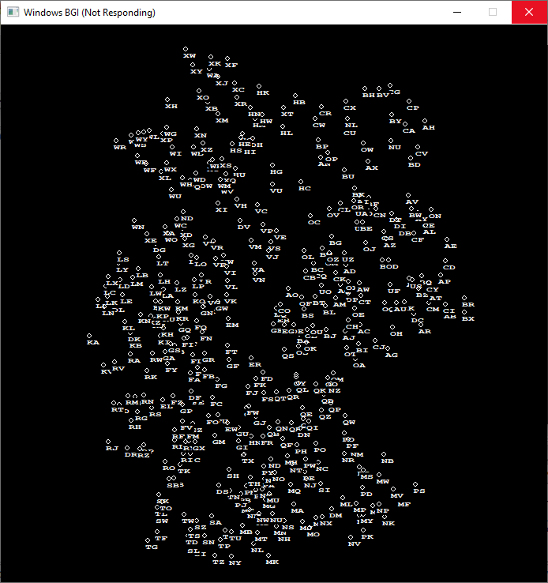

# Virtual_Radar using MVC pattern

Draw Airfield 

## Pre-requisites

<ul>
  <li> Use <strong>Windows 10/11</strong> Operating System </li>
  <li> install <strong>CodeBlocks</strong>  in your PC </li>
  <li> import <strong>os</strong> module </li>
</ul>
